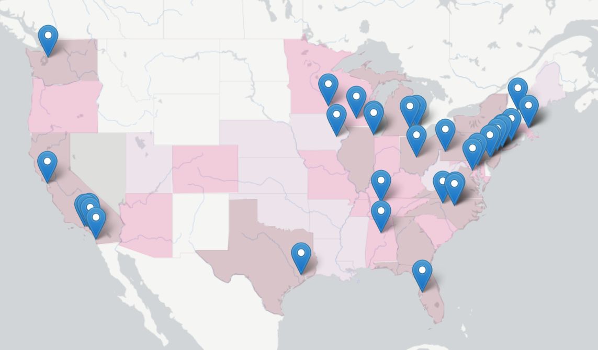
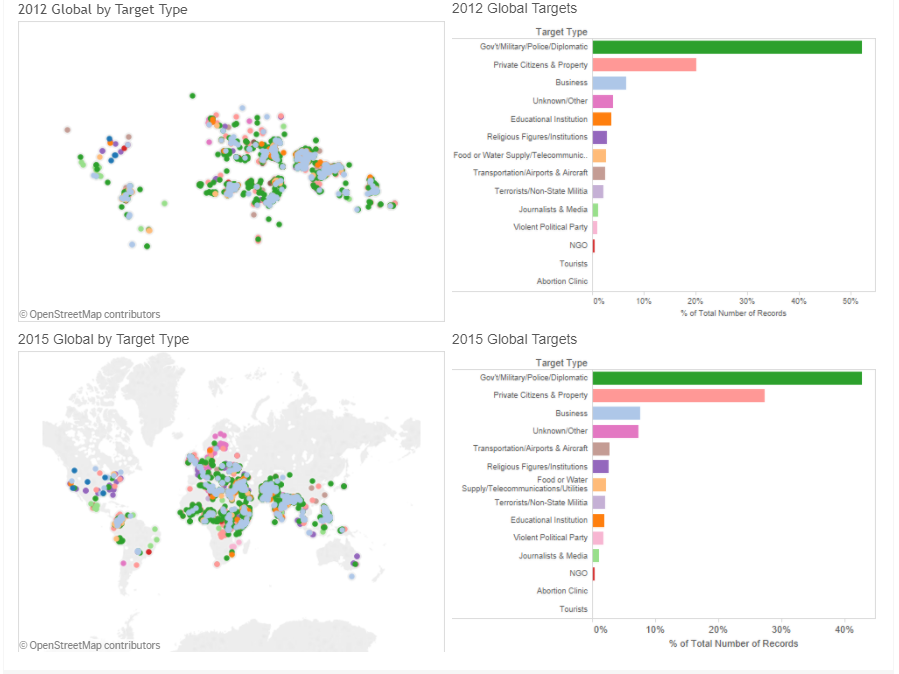
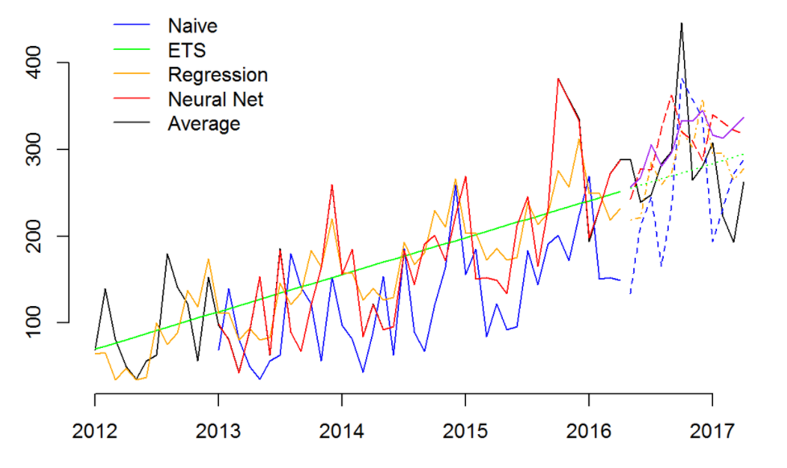
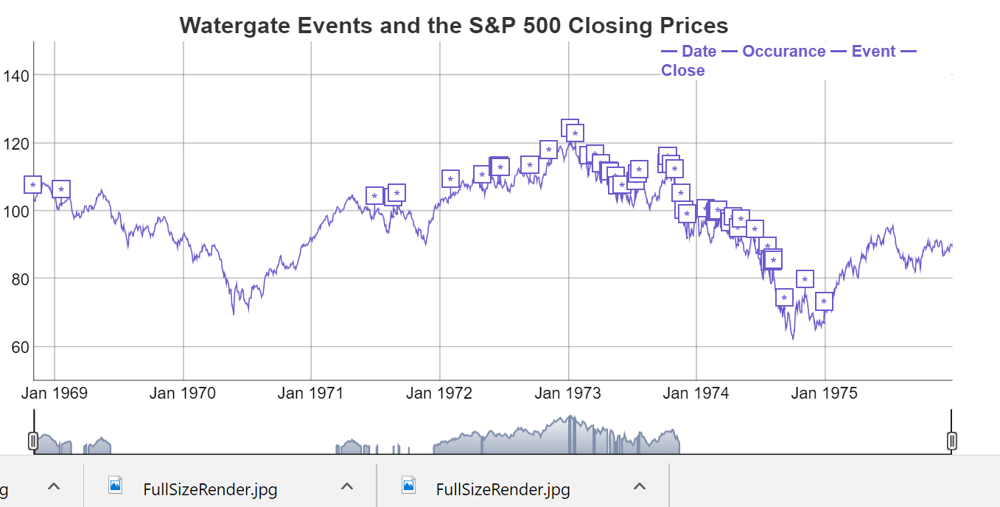

###Christine Iyer  [christine@christineiyer.com](mailto:christine@christineiyer.com)

---
Objective

To participate in business decision making processes through astute collection, statistical analysis, and compilation of all relevant data and rendering it accessible with reports, visualizations, and presentations.
Skills & Abilities

*	Data analysis, visualization, and dissemination using R Statistical Programming Language, Tableau, and Microsoft Office
*	Expert level Excel and SQL, Basic Java Programming 
*	Data product development for interactive visualizations using Shiny, an R package
*	Leadership, Management, and Customer Service Skills 
*	Languages: Spanish and French

Education

MBA | MAY 2017 | University Southern Maine, PORTLAND, ME | GPA: 4.0/4.0

*	Major: Business Administration
*	Concentration: Business Analytics
*	Related coursework: Predictive Analytics, Information Visualization, Data Management, New Product Development, Management Science

BS, MSN | 1994 & 1996 | COLUMBIA UNIVERSITY, NY, NY | GPA: 3.5/4.0

*	Earned licensure as a Registered Nurse (RN) and Certified Nurse-Midwife (CNM) with full prescriptive privileges.

Experience

RESEARCH ASSISTANT | BPEACE, NY, NY | FALL 2016 - PRESENT

*	Conducted research on potential sites in the U.S. for deployment of business volunteers in crime affected and underserved communities, with the objective of reversing the escalation of crime rates through the creation of economic opportunity.  

*	Assembled ancillary data from PDF reports using CSS selection tools and careful reading technique to augment structured datasets; located and corrected anomalies and inaccuracies and rendered the results accessible for an actionable report.

BUSINESS OWNER | FIRST & LAST TAVERN, PINE POINT, ME | 2005-2013

*	Responsible for overall recruiting and hiring of employees. 
*	Ensured appropriate staffing of team to maximize customer service and sales efforts. 
*	Developed a training manual and protocols for employees emphasizing customer service, food safety, and responsible alcohol sales in compliance with state regulations.  Ensured compliance.
*	Created an environment where enthusiastic people were recognized and rewarded for achieving organizational and personal goals.
*	Responsible for all cash controls.
*	Prepared and executed marketing, merchandising, sales, and promotional efforts to increase sales volume and guest traffic.
*	Created and maintained website.
*	Used descriptive and predictive analytics for planning of staffing and inventory. Calculated safety stock and reorder points for perishable and nonperishable items. 
*	Maintained accounting records.
*	Bookkeeping and financial reporting. 
*	Coordinated special events. 

CERTIFIED NURSE MIDWIFE | BEVERLY HOSPITAL, BEVERLY, MA | 7/09-9/2013

*	Obstetric, Gynecological, and Primary Care of Women in a Birth Center and Hospital setting. Proctored midwifery and nursing students.

CLINICAL ADJUNCT PROFESSOR | UNE, PORTLAND, ME | SPRING 2011

*	Worked as a clinical instructor in maternity and newborn nursing. Planned and presented post conference lectures.

REGISTERED NURSE | MERCY HOSPITAL, PORTLAND, ME | 9/1998-7/2005

*	Antepartum, intrapartum, postpartum, and Level 2 newborn care.

###Class Projects

[See Projects]()

|   |  |  | |
|:---:|:---:|:---:|:---:|
| Cancer | Terror | Forecasting | Stock Market |

MAPPING: 

*	[Cancers of the central nervous system -  Incidence by state and locations of top treatment centers.](https://rpubs.com/chrisiyer/220669)

*	[Global Terrorism – Are Americans fears well founded?](https://public.tableau.com/profile/christine.iyer#!/vizhome/FinalAsssignment4/Howscaredshouldwebe)  

FORECASTING: 

*	[Choosing the best forecast model to calculate safety stock and reorder points at Sigco, Inc.](https://rpubs.com/chrisiyer/Final) 

STOCK MARKET: 

*	[S&P 500 during Watergate – Watergate events plotted on the S&P500 price chart.](https://rpubs.com/chrisiyer/sp_500) 

