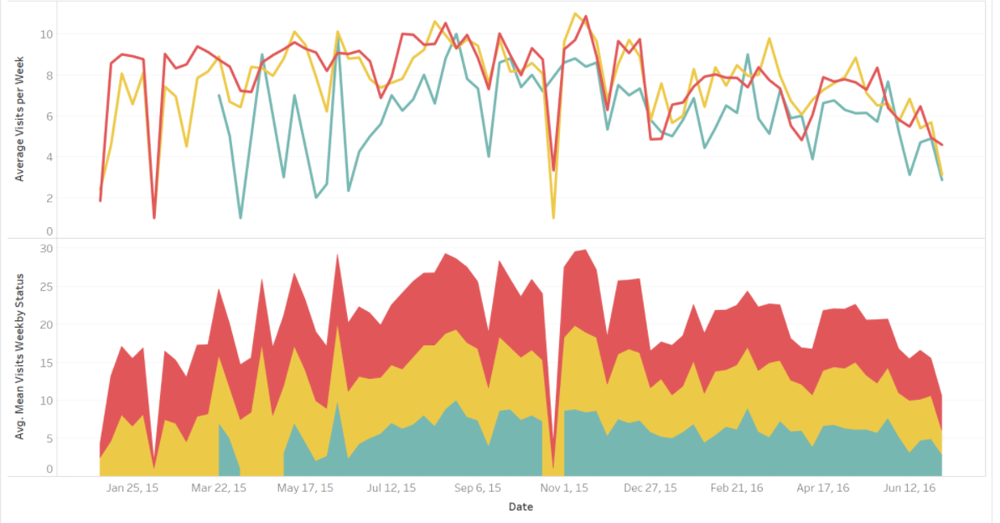

###Class Projects

|  |  |  | |
|:---:|:---:|:---:|:---:|
| Cancer | Scheduling with Simplex LP | Forecasting | Stock Market |

 
  
 
|  | ||
|:---:|:---:|:---:|
| Measuring Productivity |  |Terrorism 2012 & 2015|

MAPPING: 

*	[Cancers of the central nervous system -  Incidence by state and locations of top treatment centers.](https://rpubs.com/chrisiyer/220669)

*	[Global Terrorism – Are Americans fears well founded?](https://public.tableau.com/profile/christine.iyer#!/vizhome/FinalAsssignment4/Howscaredshouldwebe)  

FORECASTING: 

*	[Choosing the best forecast model to calculate safety stock and reorder points at Sigco, Inc.](https://rpubs.com/chrisiyer/Final) 

STOCK MARKET: 

*	[S&P 500 during Watergate – Watergate events plotted on the S&P500 price chart.](https://rpubs.com/chrisiyer/sp_500) 

SOLUTIONS:

* [Time it takes to achieve expected productivity.](http://rpubs.com/crystalPlots/SolutionNotes)

* [Scheduling fraud reviewers using Linear Programming.](http://rpubs.com/chrisiyer/Scheduling)
